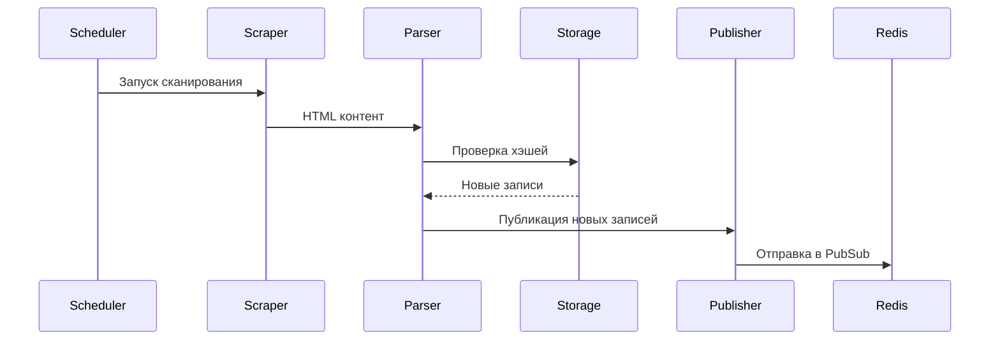

# 005 Бот - Монитор 

[](https://opensource.org/licenses/Apache-2.0)

Сервис выполняет периодическое сканирование страницы с актуальными отключениями, выявляет изменения и отправляет их в Redis PubSub.

Проект находится на стадии MVP и может содержать обратно несовместимые изменения.

## Содержание
- [005 Бот - Монитор](#005-бот---монитор)
  - [Содержание](#содержание)
  - [Установка](#установка)
    - [Требования](#требования)
    - [Локальная установка](#локальная-установка)
    - [Docker установка](#docker-установка)
  - [Используемые технологии](#используемые-технологии)
  - [Настройки](#настройки)
  - [Логика работы](#логика-работы)
  - [Разработка](#разработка)
    - [Структура проекта](#структура-проекта)
    - [Сборка](#сборка)
    - [Запуск в development режиме](#запуск-в-development-режиме)
  - [Тестирование](#тестирование)
    - [Запуск тестов](#запуск-тестов)
  - [Лицензия](#лицензия)


## Установка

### Требования

- Python 3.11+
- Redis 7.0+
- Docker (опционально)

### Локальная установка

```bash
pipenv install
pipenv run python -m app
```

### Docker установка

```bash
docker compose up --build
```

## Используемые технологии

- [Python](https://www.python.org/) - Основной язык программирования
- [Docker](https://www.docker.com/) - Контейнеризация
- [Pipenv](https://github.com/pypa/pipenv) - Управление зависимостями
- [Redis](https://redis.io/) - Хранилище данных и PubSub
- [BeautifulSoup](https://www.crummy.com/software/BeautifulSoup/) - Парсинг HTML
- [httpx](https://github.com/encode/httpx/) - HTTP клиент
- [Pydantic](https://pydantic-docs.helpmanual.io/) - Валидация данных
- [Pytest](https://docs.pytest.org/) - Тестирование

## Настройки

Для настройки используются переменные окружения:

| Название            | Описание                              | По умолчанию                        |
| ------------------- | ------------------------------------- | ----------------------------------- |
| `REDIS__URL`        | URL Redis                             | `redis://localhost:6379`            |
| `SCRAPER__URL`      | URL страницы с отключениями           | `http://93.92.65.26/aspx/Gorod.htm` |
| `SCRAPER__INTERVAL` | Период проверки обновлений в секундах | `60`                                |
| `STORAGE__TTL_DAYS` | Время хранения хэшей записей в днях   | `5`                                 |
| `STORAGE__PREFIX`   | Префикс хранилища для ключей в Redis  | `bot-005`                           |
| `PUBLISHER__PREFIX` | Префикс очереди PubSub в Redis        | `bot-005`                           |

## Логика работы

1. Сервис с периодичностью в `SCRAPER__INTERVAL` секунд запрашивает страницу по адресу `SCRAPER__URL`
2. Полученная страница разбирается на отдельные записи
3. Для каждой записи считается хэш и сравнивается с сохраненными в хранилище значениями
4. Записи, отсутствующие в хранилище считаются новыми и отправляются в очередь сообщений
5. Новые значения хэшей записываются в хранилище



## Разработка

### Структура проекта

```text
app/
├── config/       # Конфигурация
├── parser/       # Парсинг HTML
├── publisher.py  # Публикация в Redis
├── scheduler.py  # Планировщик задач
├── scraper.py    # Веб-скрейпинг
└── storage.py    # Работа с Redis
tests/            # Тесты
```

### Сборка

```bash
make build  # Сборка Docker-образа
```

### Запуск в development режиме

```bash
make dev  # Запуск с hot-reload
```

## Тестирование

### Запуск тестов

```bash
make test  # Запуск всех тестов
```

## Лицензия

Проект распространяется под лицензией [Apache 2.0](LICENSE).
